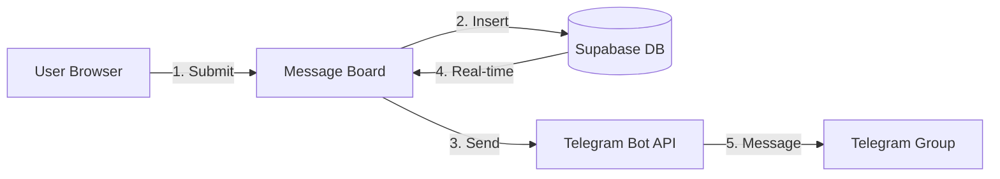

# Real-time Message Board with Telegram Integration

A public message board where users can post messages that appear instantly for everyone, with automatic Telegram notifications to configured groups.

## Features

- ✅ **Public Message Board** - Anyone can post messages with their name
- ✅ **Real-time Updates** - Messages appear instantly for all users (no refresh needed)
- ✅ **Telegram Integration** - Messages automatically sent to Telegram groups via bot
- ✅ **Activity Log** - Real-time log of all system events
- ✅ **Connection Status** - Visual indicator of real-time connection status
- ✅ **Name Memory** - Your name is saved and remembered for convenience

## Quick Start

### 1. Set Up Database

1. Go to your Supabase Dashboard: https://app.supabase.com
2. Select your project
3. Go to **SQL Editor** → **New query**
4. Copy and paste the contents of `setup-database.sql`
5. Click **Run** (or press Ctrl+Enter)
6. Verify the table was created in **Table Editor**

### 2. Configure Supabase

Open `config.js` and update with your Supabase credentials:

```javascript
window.SUPABASE_URL = 'https://your-project.supabase.co'
window.SUPABASE_ANON_KEY = 'your-anon-key-here'
```

**To get your credentials:**
- Go to Supabase Dashboard → **Settings** → **API**
- Copy **Project URL** and **anon public** key

### 3. Configure Telegram Bot (Optional)

#### Step 1: Create a Telegram Bot

1. Open Telegram and search for **@BotFather**
2. Send `/newbot` command
3. Follow the instructions to name your bot
4. BotFather will give you a **bot token** (looks like: `123456789:ABCdefGHIjklMNOpqrsTUVwxyz`)
5. Copy this token

#### Step 2: Add Bot to Your Group

1. Create a Telegram group or use an existing one
2. Add your bot to the group (search for your bot by name)
3. Make the bot an **administrator** (optional but recommended)

#### Step 3: Get Chat ID

**Method 1: Using @getidsbot**
1. Add **@getidsbot** to your group
2. It will reply with the chat ID (a negative number like `-1001234567890`)
3. Copy this number

**Method 2: Using Telegram API**
1. Send a message in your group
2. Visit: `https://api.telegram.org/bot<YOUR_BOT_TOKEN>/getUpdates`
3. Look for `"chat":{"id":-1001234567890}` in the response
4. Copy the ID (it's a negative number)

#### Step 4: Update config.js

Open `config.js` and add your bot token and chat ID(s):

```javascript
window.TELEGRAM_BOT_TOKEN = '123456789:ABCdefGHIjklMNOpqrsTUVwxyz'
window.TELEGRAM_CHAT_IDS = [
    '-1001234567890',  // Your first group
    '-1009876543210',  // Your second group (optional)
]
```

**Note:** You can add multiple chat IDs to send messages to multiple groups!

### 4. Run the Website

**Option 1: Using a Local Server (Recommended)**

```bash
cd message-board
python -m http.server 8000
```

Then open http://localhost:8000 in your browser.

**Option 2: Using Node.js**

```bash
cd message-board
npx http-server -p 8000
```

**Option 3: Direct File (May have CORS issues)**

Just double-click `index.html` (may not work due to CORS restrictions)

### 5. Test It!

1. Enter your name and a message
2. Click "Send Message"
3. The message should appear instantly on the page
4. Check your Telegram group - the message should be there too!
5. Open the page in another browser/incognito window to see real-time updates

## How It Works



1. User submits a message on the website
2. Message is saved to Supabase database
3. Message is sent to Telegram via bot API
4. Supabase real-time subscription broadcasts the new message
5. All connected browsers receive the update instantly
6. Message appears in Telegram group

## File Structure

```
message-board/
├── index.html              # Main HTML page
├── styles.css              # All styling
├── app.js                  # Application logic
├── config.js               # Configuration (Supabase + Telegram)
├── setup-database.sql      # Database setup script
└── README.md               # This file
```

## Database Schema

**Table: `public_messages`**

| Column | Type | Description |
|--------|------|-------------|
| `id` | BIGSERIAL | Auto-incrementing primary key |
| `created_at` | TIMESTAMPTZ | Timestamp (auto-generated) |
| `name` | TEXT | Display name (required) |
| `message` | TEXT | Message content (required) |
| `telegram_sent` | BOOLEAN | Whether message was sent to Telegram |

## Features Explained

### Real-time Updates

Uses Supabase real-time subscriptions to listen for new messages. When someone posts a message:
- It's inserted into the database
- Supabase broadcasts the change
- All connected browsers receive the update instantly
- No page refresh needed!

### Telegram Integration

When a message is posted:
1. Message is saved to database
2. App attempts to send to all configured Telegram chat IDs
3. Status is updated in database (`telegram_sent` field)
4. UI shows success/failure status

### Activity Log

Shows real-time system events:
- Connection status changes
- Messages sent/received
- Errors and warnings
- Telegram send status

## Troubleshooting

### Messages Not Appearing

- **Check browser console** (F12) for errors
- **Verify Supabase credentials** in config.js
- **Check RLS policies** - make sure policies allow SELECT and INSERT
- **Verify table exists** - check Supabase Table Editor

### Real-time Not Working

- **Check connection status** - should show "Connected" (green dot)
- **Verify real-time is enabled** - run the SQL script again
- **Check browser console** for subscription errors
- **Try refreshing** the page

### Telegram Not Sending

- **Check bot token** - make sure it's correct in config.js
- **Verify chat ID** - must be a negative number (group chat)
- **Check bot permissions** - bot must be in the group
- **Look at activity log** - shows Telegram errors
- **Test bot manually** - send message via Telegram to verify bot works

### CORS Errors

- **Use a local server** - don't open HTML file directly
- **Check Supabase URL** - make sure it's correct
- **Verify internet connection**

## Security Notes

- **Telegram Bot Token**: Visible in client-side code. This is acceptable for:
  - Personal/demo projects
  - Bots that only send messages
  
  For production, move Telegram API calls to a Supabase Edge Function.

- **Supabase Anon Key**: Safe to expose (designed for client-side use)
- **RLS Policies**: Currently allow public read/write (for demo). In production, add authentication.

## Customization

### Change Message Format

Edit `app.js`, function `sendToTelegram()`:

```javascript
const telegramMessage = `<b>${escapeHtml(name)}</b>: ${escapeHtml(message)}`
```

### Add More Fields

1. Update database schema in `setup-database.sql`
2. Update form in `index.html`
3. Update insert query in `app.js`
4. Update render functions

### Styling

Edit `styles.css` to customize colors, fonts, layout, etc.

## Next Steps

- Add user authentication
- Add message editing/deletion
- Add emoji reactions
- Add file/image uploads
- Add message search/filtering
- Move Telegram API to Edge Function for security

## Support

- [Supabase Documentation](https://supabase.com/docs)
- [Telegram Bot API](https://core.telegram.org/bots/api)
- [Supabase Real-time Guide](https://supabase.com/docs/guides/realtime)

## License

Free to use for personal and commercial projects.

